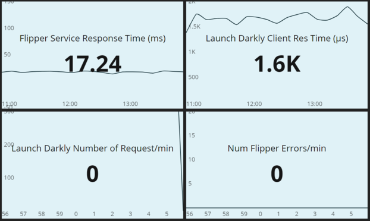
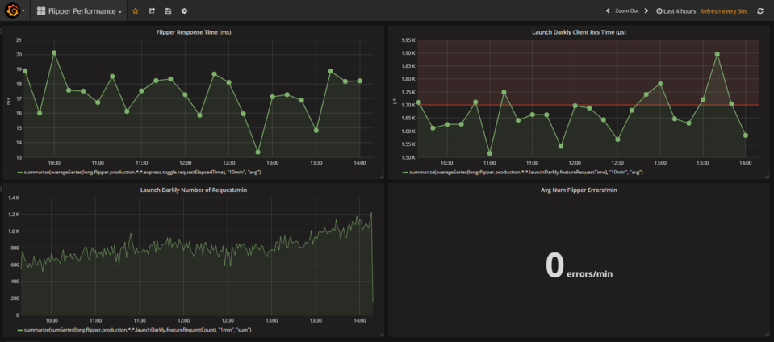

# Dasher 2 Grafana

A tool to convert old dasher dashboards into Grafana dashboards. That is, changes this:



into this:




## WARNING.
This a work in progress. Please be gentle with me if it all goes horribly wrong.

## Getting started

1. Clone this repo

1. Install dependencies - `npm install`

1. Convert your Dasher YML file into a generic JSON dashboard file

 If you don't have a dasher file to convert, skip to the next step. Otherwise, type the following command to convert your file:

 ```
 node src/cli transform dasher2generic {path_to_dasher_yml} {your_service_name}
 ```

 This should spit out some JSON and also create a JSON file called `{your_service_name}-dashboard-generic.json`. This will be the new `dasher.yml` file in future, so any changes to the dashboard config should be applied here.

 Any problems, raise an issue here and provided a link to the dasher YML file.

1. Convert your newly created generic JSON file into a Grafana compliant JSON file.

 If you didn't convert a dasher file, you can create one from scratch. See the [Dashboard JSON format](./dashboard.md) for more details.

 Once you have JSON file in the generic format, then run this command to convert it into JSON suitable for uploading into Grafana.

 ```
 node src/cli transform generic2grafana {path_to_generic_json} {your_service_name}
 ```
 This should spit out more JSON and create a number of files, depending on the number of dashboards in your original `dasher.yml`. Look for files starting `{your_service_name}-*.json`

  Any problems, raise an issue here and provided a link to the dasher YML file or upload your generic JSON file.

1. Send your newly created dashboard files to Grafana.
 ```
 curl -XPOST "http://grafana.dun.fh:3000/api/dashboards/db" -H "Accept: application/json" -H "Content-Type: application/json" -H "Authorization: Bearer {api_token}" -d @{path_to_your_json_file}
 ```

 Find the `{api_token}` in vault under `secrets\grafana\api_key`

 if all goes well, something like the following should be returned:

 ```
 {"slug":"titan-request","status":"success","version":1}%
 ```

1. Navigate to [Grafana](http://grafana.dun.fh:3000) (no need to logon, anonymous access is enabled) and Navigate to `Dashboards -> Home`. From `Home` pulldown menu, locate your dashboard and check that everything is OK.

1. Next steps
 * Use grafana to automatically created a playlist of yoiur dashboard. (`Dashboards -> Playlist)`)
 * Update your generic JSON file to add some eye candy, like points on the data values or a threshold value for your graph. See [Dashboard JSON format](./dashboard.md) for more details on how to tweak your dashboard.
