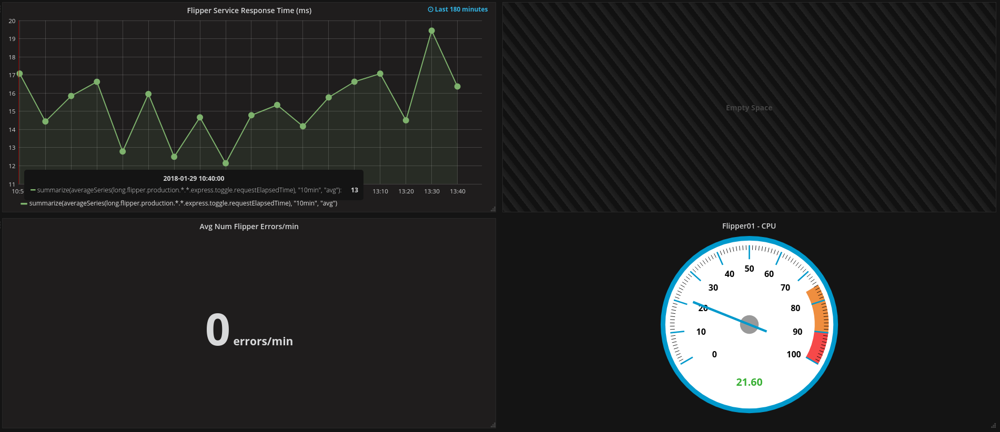

# Dasher 2 Grafana

A tool to convert old dasher dashboards into Grafana dashboards

## WARNING.
This a work in progress. Please be gentle with me if it all goes horribly wrong.

## Getting started

1. Clone this repo

1. Install dependencies - `npm install`

1. Convert your Dasher YML file into a generic JSON daashboard file
 ```
 node src/cli transform dasher2generic {path_to_dasher_yml} {your_service_name}
 ```

 This should spit out some JSON and also create a JSON file called `{your_service_name}-dashboard-generic.json`. This will be the new `dasher.yml` file in future, so any changes to the dashboard config should be applied here.

 Any problems, raise an issue here and provided a link to the dasher YML file.

1. Convert your newly created generic JSON file into a Grafana compliant JSON file.
 ```
 node src/cli transform generic2grafana {path_to_generic_json} {your_service_name}
 ```
 This should spit out more JSON and create a number of files, depending on the number of dashboards in your original `dasher.yml`. Look for files starting `{your_service_name}-*.json`

  Any problems, raise an issue here and provided a link to the dasher YML file.

1. Send your newly created dashboard files to Grafana.
 ```
 curl -XPOST "http://grafana.dun.fh:3000/api/dashboards/db" -H "Accept: application/json" -H "Content-Type: application/json" -H "Authorization: Bearer {api_token}" -d @{path_to_your_json_file}
 ```

 Find the `{api_token}` in vault under `secrets\grafana\api_key`

 if all goes well, something like the following should be returned:

 ```
 {"slug":"titan-request","status":"success","version":1}%
 ```

1. Logon to [Grafana](http://grafana.dun.fh:3000) and Navigate to `Dashboards -> Home`. From `Home` pulldown menu, locate your dashboard and check that everything is OK.

1. Next steps
 * Use grafana to automatically created a playlist of yoiur dashboard. (`Dashboards -> Playlist)`)
 * Update your generic JSON file to add some eye candy, like points on the data values or a threshold value for your graph. Check the `draw_options` object in the JSON file. Thresholds on a graph can be defined as follows:

  ```json
  "thresholds": [{
    "value": 100,
    "colour": "critical",
    "fill": true,
    "line": true,
    "operation": "gt"
  }]
  ```
  Docs on the properties in the generic JSON file are coming soon! In the meantime, take a look at an [example generic JSON file](./examples/neutral.json) which holds a dashboard that contains a graph, guage and a single number.

  

  The format, in general is that each file contains a `dashboards` object and each property in that object is the name of a dashboard. Each dashboard consists of `rows` and each row can have one or more `widgets`.  Each widget has `draw_options` that desibe how the widget should look; each widget type has a different set of `draw_options`. Most should be self explanatory.

  The `width` property of a widget is the percentage width of the window to use for the widget, so a row that contains three widgets would have a value of 33, four widgets in a row then the width is 25.  We can mix and match. E.g.: It's possible to have 2 widgets in a row, one that is using 25% of the window width, the other that is using 75%.
